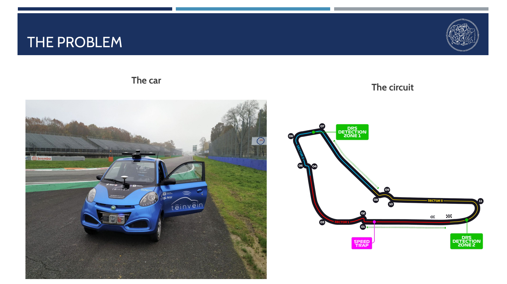
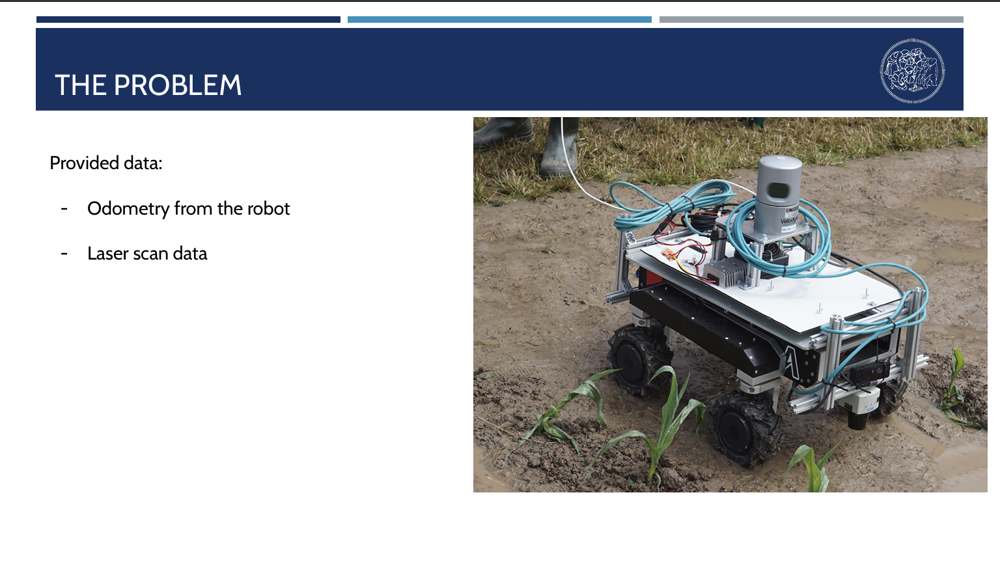

# ROS1-2d-mapping-navigation
Developed a full ROS1 pipeline for 2D mapping and navigation, using laser scan fusion and the gmapping SLAM algorithm to generate an occupancy grid map, followed by Stage simulation and a tuned navigation stack (DWA, AMCL) for localization and autonomous collision-free path planning.

 ## 🚀 Project Summary
Group project for the course “Perception, Localization and Mapping for Mobile Robots”.

• Task_1: Designed and implemented a ROS1-based system for estimating robot odometry from both vehicle kinematics and GPS data. The comparison clearly highlighted the rapid drift of the kinematic-only solution versus the more stable and accurate GPS-based odometry. This project provided hands-on experience with ROS nodes, topics, messages, TF frames, and RViz.

• Task_2: Built a 2D map of the environment by fusing data from two laser scanners into a single 360° scan and feeding it into the gmapping package. Despite the map’s limited accuracy (due to externally provided noisy odometry) the pipeline correctly handled scan alignment and filtering of robot body reflections. Mapping parameters were carefully tuned with awareness of the odometry noise, iteratively adjusting settings to improve the quality of the generated map.

• Task_2 (pt.2): Simulated the robot in Stage, integrating it with the ROS navigation stack to perform autonomous motion and obstacle avoidance within the reconstructed map. The system was configured with DWA for local planning and AMCL (particle filter) for probabilistic localization, requiring careful tuning of numerous parameters (e.g., inflation radius, costmap resolution, number of particles) to ensure stable and collision-free navigation.

| Task_1 | Task_2 |
|------------|--------------------|
|  |  |

## 📁 Contents

## ▶️ How to Run the Simulation

## 📷 Results

## 🛠️ Technologies Used
