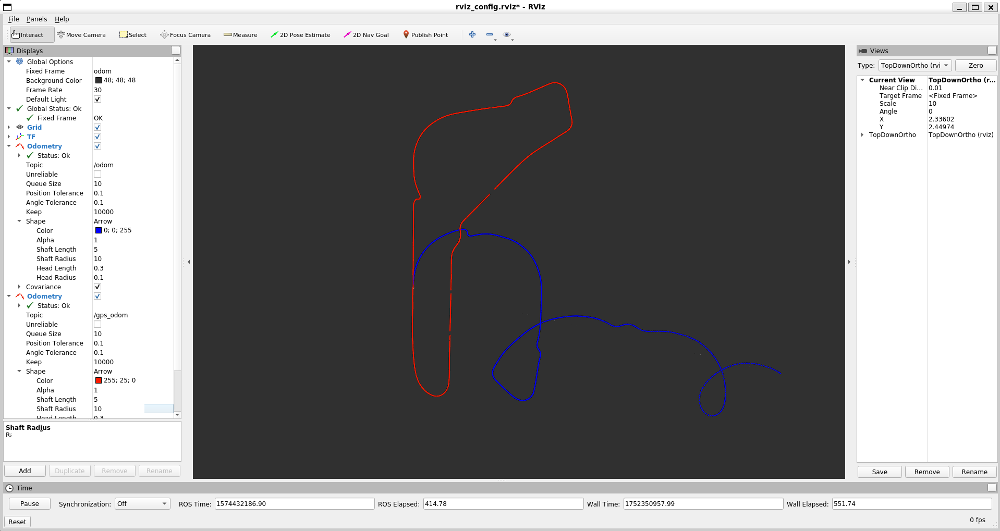
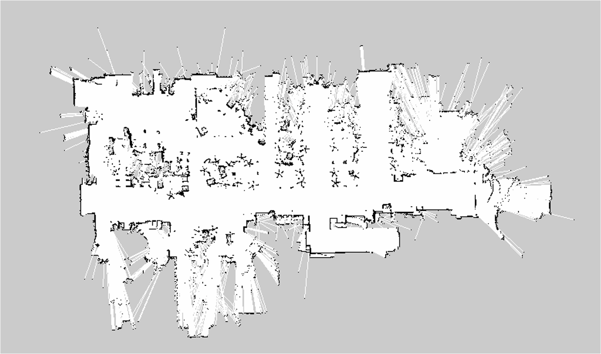
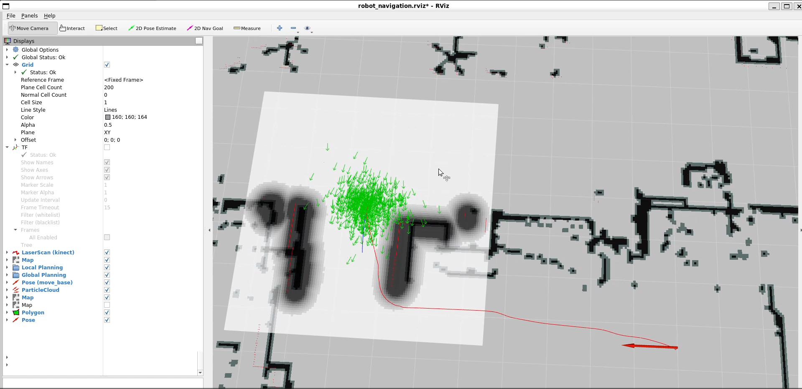

# ROS1-2d-mapping-navigation
Developed a full ROS1 pipeline for 2D mapping and navigation, using laser scan fusion and the gmapping SLAM algorithm to generate an occupancy grid map, followed by Stage simulation and a tuned navigation stack (DWA, AMCL) for localization and autonomous collision-free path planning.

 ## 🚀 Project Summary
Group project for the course “Perception, Localization and Mapping for Mobile Robots”.

• Task_1: Designed and implemented a ROS1-based system for estimating robot odometry from both vehicle kinematics and GPS data. The comparison clearly highlighted the rapid drift of the kinematic-only solution versus the more stable and accurate GPS-based odometry. This project provided hands-on experience with ROS nodes, topics, messages, TF frames, and RViz.

• Task_2: Built a 2D map of the environment by fusing data from two laser scanners into a single 360° scan and feeding it into the gmapping package. Despite the map’s limited accuracy (due to externally provided noisy odometry) the pipeline correctly handled scan alignment and filtering of robot body reflections. Mapping parameters were carefully tuned with awareness of the odometry noise, iteratively adjusting settings to improve the quality of the generated map.

• Task_2 (pt.2): Simulated the robot in Stage, integrating it with the ROS navigation stack to perform autonomous motion and obstacle avoidance within the reconstructed map. The system was configured with DWA for local planning and AMCL (particle filter) for probabilistic localization, requiring careful tuning of numerous parameters (e.g., inflation radius, costmap resolution, number of particles) to ensure stable and collision-free navigation.

| Task_1 | Task_2 |
|------------|--------------------|
|  |  |

## 📁 Contents

- `first_project/`: ROS1 package for Task 1 (odometry estimation). Includes launch files, custom message definitions, RViz configuration, and source code for:
  - Odometry from vehicle kinematics
  - Odometry from GPS data
  - Sector time computation  
  ➤ See `readme_first_project.txt` for execution instructions.

- `second_project/`: ROS1 package for Task 2 (mapping and navigation). Contains launch files, config files, maps, goal sequences, RViz setups, and source code for:
  - Laser scan fusion and gmapping-based mapping
  - Stage simulation setup
  - Navigation stack integration with DWA and AMCL  
  ➤ See `readme_second_project.txt` for mapping and navigation usage.

- `data/`: ROS bag files used for both tasks:
  - `project.bag`: odometry and GPS data for Task 1
  - `robotics2.bag`: laser and odometry data for Task 2

- `images/`: figures used in the README to visualize mapping and navigation results.

## ▶️ How to Run the Simulation

The repository contains two independent ROS1 packages (`first_project/` and `second_project/`), each with its own set of nodes, launch files, and configurations.

To run the simulations:
- Refer to `readme_first_project.txt` and `readme_second_project.txt` for detailed instructions on how to launch each task.
- Ensure that the packages are placed inside the `src/` folder of a valid ROS1 workspace.
- Modify `CMakeLists.txt` and `package.xml` if needed, based on your ROS environment.
- Source your workspace (`source devel/setup.bash`) and use `roslaunch` to start the nodes.
- If working in a containerized setup, ensure that Docker is correctly configured with ROS and RViz GUI support.

## 📷 Results

### 🔹 Task 1 – Odometry Estimation

The image below shows the comparison between the odometry computed from vehicle kinematics (blue trajectory) and from GPS data (red trajectory). The strong drift in the kinematic-based estimate is clearly visible, highlighting the importance of robust localization methods in mobile robotics.

---

### 🔹 Task 2 – Mapping and Navigation

| 2D Mapping with Gmapping | Autonomous Navigation |
|--------------------------|------------------------|
|  |  |

- **Left:** The occupancy grid map generated via laser scan fusion and the gmapping SLAM algorithm. Despite the noisy input odometry, the system correctly reconstructs key structural features of the environment.

- **Right:** Navigation stack in action within the simulated environment. The global path (red), local trajectory (blue), and green AMCL particles for localization are shown. The white square indicates the dynamically updated local costmap used for collision-free planning.

## 🛠️ Technologies Used

- ROS1 (Robot Operating System)
- C++ (node implementation and custom messages)
- RViz (visualization)
- Stage (2D robot simulation)
- Gmapping (SLAM for occupancy grid mapping)
- DWA (Dynamic Window Approach) for local planning
- AMCL (Adaptive Monte Carlo Localization) for particle-filter-based localization
- ROS Bag files for offline sensor data replay

